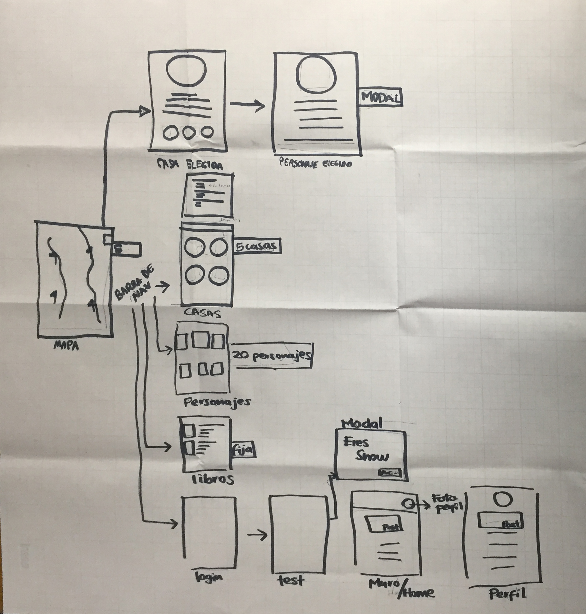
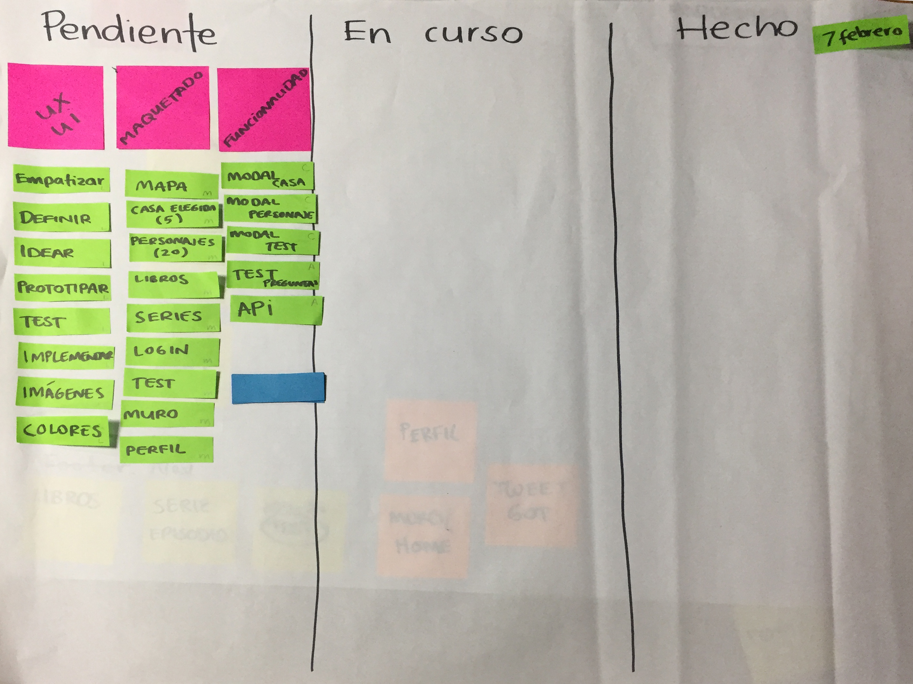
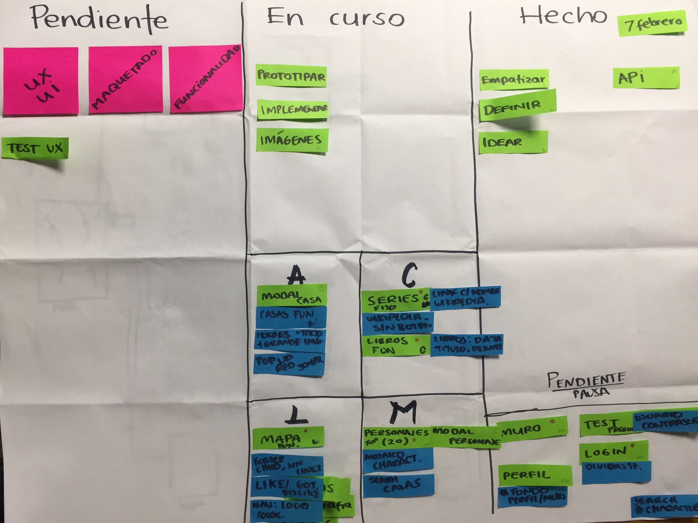
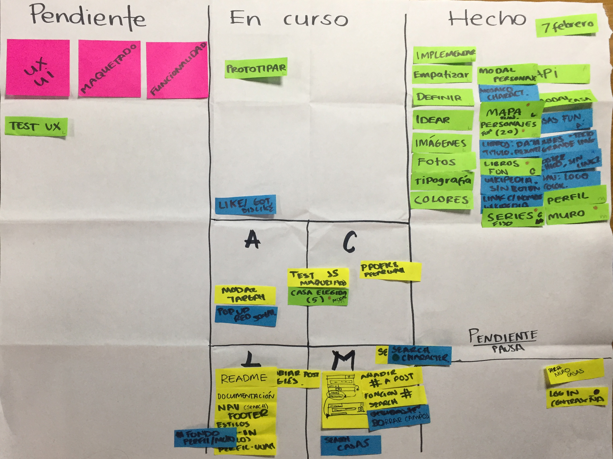
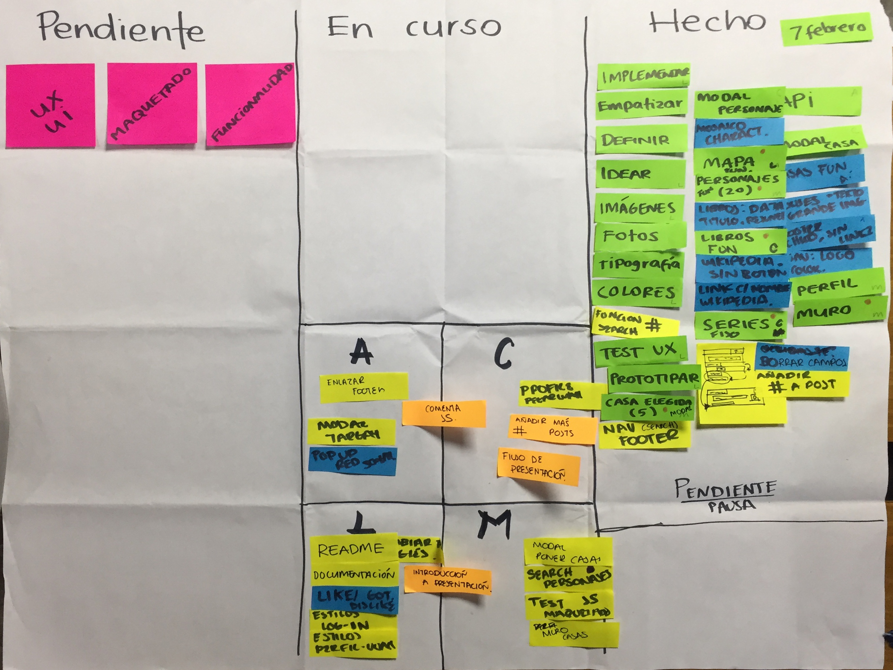

# GAME OF THRONES APP
## Objetivo

El objetivo es demasiado claro, crear una aplicación móvil que permita a los usuarios obtener toda la información sobre Game of Thrones. Dentro de ella se encuentran las siguientes funciones:

-    Utilizar la API sobre Game of Thrones: Ice and Fire para acceder a la información sobre casas y personajes.
-    Obtener toda la información sobre los libros publicados.
-    Entrar a la red social:
  - Hacer un test que te diga a que casa perteneces.
  - Adaptar tu perfil, depende a tu casa.
  - Ver dentro de tu perfil tus publicaciones.
  - Publicar (dentro de un límite de caracteres) fan theories, comentar    sobre capítulos o temas relacionados con Game of Thrones.
  - Visitar newsfeed donde podrás observar tus publicaciones y las de tus amigos.

## Empatizar
A lo largo de nuestra vida, y de manera cotidiana, estamos vinculados y nos relacionamos con otras personas, de acuerdo a nuestras actividades, intereses, aficiones, hobbies, etc. El ser humano no podría vivir sin relacionarse con otros humanos, puesto que tiene una esencia de ser social que lo dispone a accionar en conjunto con otras personas, diferentes ámbitos. Necesita compartir objetivos, metas o intereses comunes y aquí es donde entra la app, que no sólo te ayuda a encontrar información que necesites sobre Game of Thrones, si no que te ayuda a formar parte de la comunidad.

Teniendo todas estas cuestiones en cuenta, se comienza a trabajar en el sitio y crear la experiencia de usuario. La decisión de hacerla app, se tomó para que el usuario tenga la información más accesible y no necesite encender una computadora cada que esté viendo un capítulo o necesite consultar un dato. Otra decisión importante fue concebirla en inglés, porque así abarcamos un público más global.

### Idear
Las vistas planeadas fueron las siguientes:

#### User testing
Después de idear el producto, se mostró a posibles usuarios y checamos si nuestras propuestas en la arquitectura de la información eran válidas y aceptadas.

#### Implementación
Después de haber sido validado, se procede a la implementación, con los siguientes puntos:
1. Tipografía:
Se manejaron dos tipografías, para títulos "Cenzil" y párrafos "Open Sans"
2. Colores:
Ya que tenemos un test con el cual te puedes identificar con una casa en particular, se utilizaron los colores de sus escudos, para la red social.
Dentro de la página con toda la información sobre Game of Thrones se manejó escala de grises, ya que son colores neutros y hacen destacar los de las casas.

## Nuestra planeación:
### Acuerdos
Inicio: No hay roles establecidos, el primer alcance es aterrizar la idea;  una vez definidos los objetivos se procede a un primer prototipo que es realizado en conjunto.
Nuestra arquitectura de la información  cambio ligeramente al analizar  nuestro research.
Herramientas digitales de la organización: Google drive, GH.
Hacer daily al inicio y final del día, para ver la actualización del tablero de Pendiente, En curso, Hecho.

### 6/02/18

### 7/02/18
Inicio del día

Final del día

### 8/02/18
Inicio del día

Final del día

